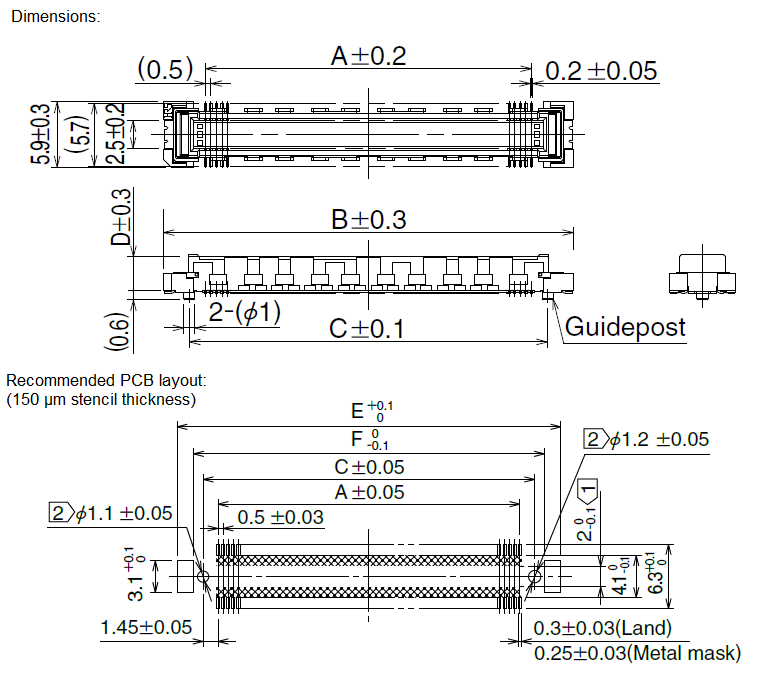
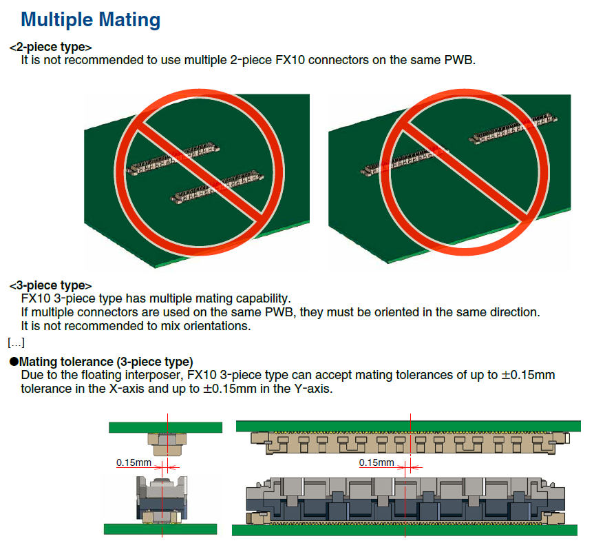
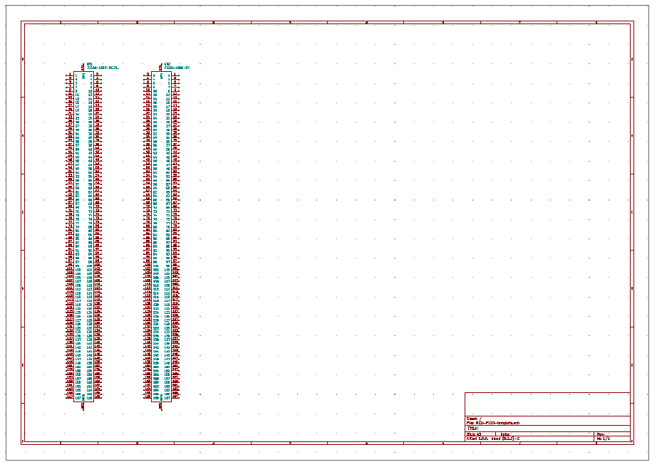
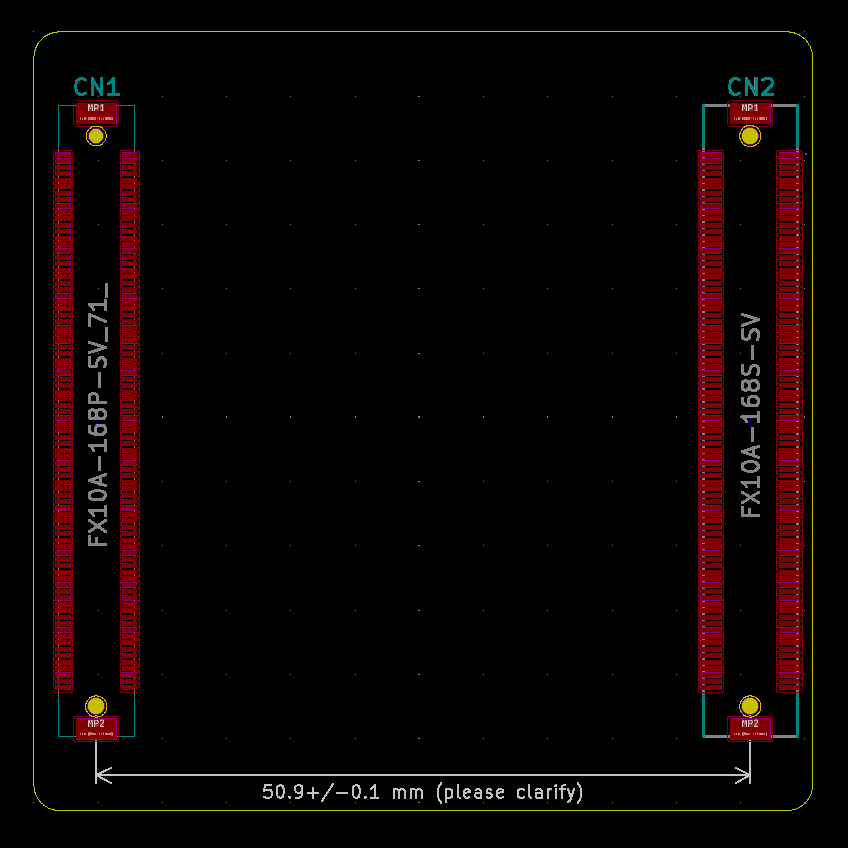
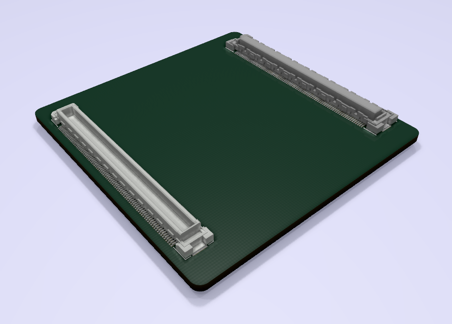

# FX10A-168 MCU Card Template #

KiCAD libraries, schematic and layout to get you started creating open source hardware.

### Connectors ###

CON1: [Hirose FX10A-168P-SV(71)](https://www.hirose.com/product/p/CL0570-0044-8-71?lang=en)

CON2: [Hirose FX10A-168S-SV](https://www.hirose.com/product/p/CL0570-0244-7-00?lang=en)

IP: [Hirose FX10-168IP-8H(03)](https://www.mouser.de/datasheet/2/185/FX10_CL0608-0003-9-03_2d-1615410.pdf)

The design presented herein uses two connectors outside their specifications. Proper connector use that allows for practical misalignment from manufacturing and assembly tolerances calls for the use of an interposer part for each connector to achieve +/- 0.3 mm tolerance (see [FX10 Catalog](https://www.hirose.com/product/series/catalogdownload?category=FX10)).

As can be seen in the drawing, the pegs both have 1.0 mm diameter. There is also a subtle chamfer on the pegs. Using a 1.0 mm drill diameter would cause an interference fit and may end up with a part that cannot be assembled, so the specified 1.1 mm is chosen on one side to presumably constrain the part position. 

Hint: If the designed PCB is required to mate with existing board hardware, it is recommended to visually inspect the existing reflow result for symmetry and representative alignment, followed by inserting mating connectors and measuring the peg inner and 
outer distances on both sides with calipers or preferably inside and outside micrometers.

Manufacturer recommendations for connector use:

### Schematic ###

Note: schematic symbols are representative of geometric arrangement of pins. The convention in the libraries is in analogy to the [Myriad-RF connector specification](https://wiki.myriadrf.org/RFDIO) and common dual-row pin headers. Libraries supplied with this design have been compiled from different sources and modified for consistency.

### Board ###

Note: The connector spacing has been set to 50.9 mm. According to [datasheet specifications](http://www.farnell.com/datasheets/2691101.pdf), a maximum position error of +/-0.15 mm in the XY-plane is acceptable for a board with mutiple connectors when interposers are additionally used, which needs to cover NPTH drill / land pattern tolerance and the loose fit of the locating pegs on top of any potential design mismatch to a motherboard in question, so check whether the pitch needs to be 50.8 mm, 51.0 mm or something else. It is assumed that reflow soldering aligns the connectors with the land pattern while being constrained by pegs in NPTHs. Surface tension will reliably align the connectors vertically. Horizontally, there are two columns each of toe and heel fillets which should center the connectors horizontally. It has been observed with TSSOP and non-optimized land patterns that parts can be pulled to one side or the other. If problems arise, stencil thickness, or geometric adjustments might be necessary.

### Disclaimer ###

Files in this project are provided as-is. No responsibilities for damage or harm caused by its use will be accepted.
Corrections and suggestions are always welcome. 

### Changes ###
20200531 - first draft
